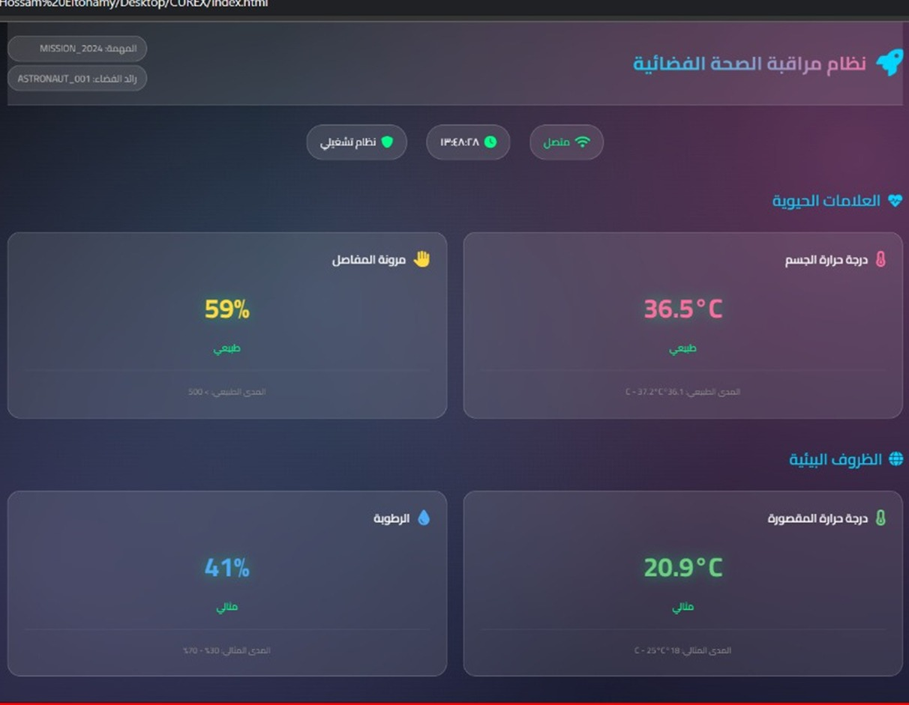

# 🧤 CUREX — Smart Therapeutic Glove

> **NASA Space Apps Challenge 2025 — 2nd Place, Regional Level**

CUREX is a smart glove that delivers real-time hot/cold therapy for joint pain relief — designed for astronauts experiencing rheumatoid-like symptoms in zero gravity, and applicable to patients on Earth. Built as a fully integrated hardware-software prototype under competition conditions.

---

## The Problem

Astronauts in space face prolonged exposure to zero gravity, which weakens bones and muscles and causes joint pain, stiffness, and inflammation — symptoms similar to rheumatoid arthritis. With limited medical equipment available and continuous painkiller use causing long-term side effects, there is a clear need for a drug-free, real-time pain management solution.

---

## The Solution

CUREX is a wearable smart glove that:
- Delivers **targeted heat therapy** (38°C–42°C) to stimulate blood circulation and reduce muscle stiffness
- Delivers **targeted cold therapy** (15°C–20°C) to reduce inflammation and swelling
- Monitors the user's condition in **real time** via onboard sensors
- Transmits live health data to a **mobile/web dashboard** over WiFi

---

## Demo

| Prototype | Dashboard |
|-----------|-----------|
|  |  |

---

## Hardware Components

| Component | Role |
|-----------|------|
| Arduino Uno | Main microcontroller |
| ESP32 / ESP8266 | WiFi communication |
| DHT11 | Ambient temperature & humidity |
| LM35DZ | Body temperature measurement |
| FSR sensor | Swelling detection (pressure) |
| Flex sensor | Finger bending detection |
| Peltier module | Heating & cooling actuation |
| Breadboard + wires | Circuit assembly |
| Battery + holder | Power supply |

---

## System Architecture

```
Sensors (DHT11, LM35, FSR, Flex)
        ↓
Arduino Uno — reads & processes sensor data
        ↓
ESP32 — transmits data over WiFi
        ↓
Web Dashboard — displays real-time health status
        +
Peltier Module — applies heat or cold based on readings
```

---

## Therapy Parameters

| Mode | Temperature Range | Effect |
|------|------------------|--------|
| Heat therapy | 38°C – 42°C | Stimulates blood flow, reduces muscle stiffness |
| Cold therapy | 15°C – 20°C | Reduces inflammation, numbs pain signals |

---

## Repository Structure

```
curex/
├── src/
│   └── curex_main.ino        # Arduino source code
├── dashboard/
│   └── index.html            # Real-time monitoring dashboard
├── docs/
│   ├── presentation.pdf      # NASA Space Apps competition slides
│   └── circuit_diagram.png   # Wiring diagram
└── assets/
    ├── prototype_photo.jpg
    └── dashboard_screenshot.png
```

---

## How to Run

1. Wire the components according to `docs/circuit_diagram.png`
2. Open `src/curex_main.ino` in Arduino IDE
3. Install required libraries:
   - `DHT sensor library` by Adafruit
   - `ESP8266WiFi` or `WiFi` (for ESP32)
4. Set your WiFi credentials in the sketch:
   ```cpp
   const char* ssid = "YOUR_WIFI";
   const char* password = "YOUR_PASSWORD";
   ```
5. Upload to Arduino Uno
6. Open `dashboard/index.html` in a browser to view live data

---

## Future Work

- Add **MAX30102** sensor for pulse and blood oxygen monitoring
- Expand from glove to full suit — knee, elbow, and shoulder joints
- Integrate AI algorithms to predict pain/inflammation onset from sensor trends and trigger therapy automatically

---

## Team — CUREX

Built at **NASA Space Apps Challenge 2025**, Egypt

- Hossam Hassan
- Lames Mostafa
- Gehan Mahmoud
- Basmalla Ahmed
- Nada Waleed
- Amr Tamer

---

## Award

**2nd Place — Regional Level**, NASA Space Apps Challenge 2025
